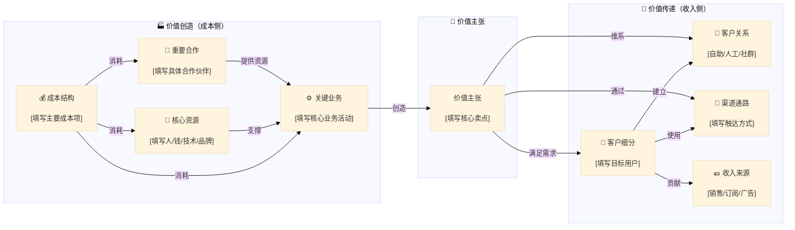

# Step 1：商业模式与企业质量（⭐核心，35%）

> **输入**：step0_data.json → **输出**：step1_quality.json（1.1-1.4评分，供 Step 5/7 使用）

**巴菲特选股四条件**：①良好护城河（→1.2）②称职管理层（→1.3）③价格有吸引力（→Step 4）④熟悉行业（→1.1）。四条件缺一不可。

### 1.1 商业模式可理解性（0-25分）

**评估标准**：能否一句话说清楚怎么赚钱？收入来源是否清晰可预测？

**商业模式四维总结**（报告开头必须用一段话精炼概括）：

| 维度 | 核心问题 | 分析要点 |
|------|---------|---------|
| 获客模式 | 客户从哪里来？获客成本是多少？ | 获客渠道（自然流量/付费投放/渠道分销/口碑推荐）/ CAC（单客获取成本）/ 获客效率趋势 |
| 运营模式 | 如何交付价值？运营成本如何？ | 交付方式（产品/服务/平台）/ 运营成本结构（固定vs变动）/ 规模效应是否存在 |
| 盈利模式 | 单位经济模型是否成立？ | LTV（单客生命周期价值）/ LTV:CAC 比值（>3为健康）/ 单客收入 > 单客成本？ |
| 扩张模式 | 如何实现规模增长？ | 复制门店/病毒传播/大客户依赖/平台网络效应/加盟扩张/并购整合 |

**四维总结写作模板**（填入报告"商业模式"章节开头）：
> {公司名}的商业模式：通过{获客渠道}获取客户（获客成本约{X}元），以{运营模式}交付价值（运营成本{Y}），单客经济模型{成立/不成立}（LTV:{A} vs CAC:{B}，比值{C}），扩张依赖{扩张模式}。

**四维健康度速判**：
- 四维全部清晰且正向 → 20-25分（商业模式极优）
- 三维清晰，一维存疑 → 15-19分（基本可行）
- 两维清晰，两维模糊 → 10-14分（需深入验证）
- 核心维度（盈利/获客）不成立 → 0-9分（商业模式存疑）

**四问检验法快速过滤**：Q1卖什么？→ Q2客户为何选你？→ Q3为何没被资本抢走生意？→ Q4给100亿能否复制？四问全有清晰答案=值得深入；任一答不清=高度警惕。

**林奇六类公司分类**：缓慢增长（股息率）/ 稳健增长（PEG 1.0-1.5）/ 快速增长（PEG 0.5-1.0）/ 周期性（正常化PE，低PE=危险信号）/ 困境反转 / 隐蔽资产。

**邱国鹭行业四维度**：商业模式（轻资产、高周转）/ 竞争格局（CR3>60%）/ 行业空间（>100亿，渗透率<30%）/ 行业门槛（牌照/技术/品牌/规模）。

**📚商业模式扩展**：详见 `references/investment-theory.md`

### 1.1.1 行业特异性指引

行业特异性指引表（7行业关键维度+5行业巴菲特框架）📚§35

### 1.1.2 商业模式画布（Mermaid 可视化）

> 商业模式画布是分析企业"怎么赚钱"的最经典工具，9个模块讲清价值创造→价值传递的完整逻辑。

**执行要求**：每个公司分析必须绘制商业模式画布 Mermaid 图，基于实际调研数据填充各模块内容。

**画布结构**（左侧=价值创造，右侧=价值传递）：

**各模块填写指引**：

| 模块 | 核心问题 | 填写要点 |
|------|---------|---------|
| 价值主张 | 客户为什么选你？ | 核心卖点/差异化价值/解决的痛点 |
| 客户细分 | 目标用户是谁？ | 用户画像/细分市场/付费意愿 |
| 渠道通路 | 如何触达用户？ | 线上/线下/直销/分销/平台 |
| 客户关系 | 如何维系用户？ | 自助服务/人工客服/社群运营/会员体系 |
| 收入来源 | 如何赚钱？ | 产品销售/订阅/广告/佣金/授权 |
| 核心资源 | 靠什么赚钱？ | 人才/技术/品牌/资本/数据/牌照 |
| 关键业务 | 做什么赚钱？ | 平台运营/研发/生产/营销/服务 |
| 重要合作 | 谁帮你赚钱？ | 供应商/渠道商/互补方/战略伙伴 |
| 成本结构 | 花钱在哪？ | 研发/营销/人力/服务器/原材料/物流 |

**因果关系检验**（填写后必须验证）：
- [ ] 价值主张 → 是否匹配客户细分的真实需求？
- [ ] 核心资源 → 是否支撑关键业务的执行？
- [ ] 收入来源 - 成本结构 → 是否正向盈利？
- [ ] 渠道通路 → 是否能有效触达客户细分？
- [ ] 客户关系 → 是否与价值主张一致？（高端品牌=人工服务，平台=自助+社群）

**商业模式画布评分参考**（辅助 1.1 评分）：
- 9模块全部清晰且逻辑自洽 → 20-25分
- 7-8模块清晰，逻辑基本通顺 → 15-19分
- 5-6模块清晰，部分逻辑存疑 → 10-14分
- 核心模块模糊或逻辑断裂 → 0-9分

### 1.1.3 话语权评估：商业模式的"求"框架

> 商业模式本质 = 利益相关者之间"谁有求于谁"的关系。"求"的外在表现 = 话语权、定价权的让渡方向。

**三维度评估**：上游求（供应商挤破头合作）+ 下游求（消费者排队购买）+ 政府求（纳税大户被呵护）

**四档评级**：

| 档位 | 含义 | 典型案例 | 商业模式评价 |
|------|------|---------|-------------|
| 三求 | 上游求+下游求+政府求 | 茅台/苹果/比亚迪 | 极优 |
| 两求 | 其中两项 | 有色(上游+政府)/迪子(上游+政府) | 优秀 |
| 一求 | 仅一项 | 95%企业（上下游平等对话，政府因税收呵护） | 一般 |
| 0求 | 全不求 | 地产/市区重工业加工 | 极差 |

**0求企业避坑逻辑**：
- 上游不惯着你：你产品涨价，他涨得更狠更早（如地产面粉盯着面包涨）
- 下游不惯着你：你得求消费者买，装孙子求爷爷告奶奶
- 政府不求你：交了税还得求
- 本质是"受气型"商业模式，即使短期利润好，长期回报率必然低于三求/两求企业

**与评分映射**：三求 22-25 / 两求 18-21 / 一求 14-17 / 0求 0-9（触发⚠️降级警示，但**不额外乘0.85系数**——评分压低已在Step 1分数中体现，与排除检查汇总表的"综合得分×0.85"是两种不同机制）

**评分标准**：20-25分（一句话说清，收入可预测）/ 15-19分（基本清晰）/ 10-14分（复杂但可理解）/ 0-9分（无法理解）

**行业校准**：科技/医药类15分以上即优秀；消费品/金融类应追求20分以上；平台类需理解网络效应。

### 1.1.3 商业模式四模式拆解

> "四问检验法"回答"卖什么/为何选你/为何不被抢走/能否复制"，本节进一步拆解"怎么赚钱"的底层结构。

**①收入模式**：卖产品 vs 卖服务 / 一次性收入 vs 持续性收入（订阅/复购/平台抽成）/ 收入是否稳定可预测。**判断标准**：持续性收入占比越高，商业模式越优。

**②成本结构**：主要成本是什么（原材料/人工/研发/营销）/ 固定成本 vs 变动成本比例 / 是否具备规模效应（规模越大单位成本越低）。**判断标准**：高固定成本+规模效应 = 强边际利润弹性。

**③盈利模式**：毛利率来源（品牌溢价/成本优势/技术壁垒）/ 净利润受哪些因素影响（费用控制/资产减值/投资收益）/ 盈利是否容易被竞争侵蚀。**判断标准**：毛利率>40%且稳定 + 净利率持续改善 = 强盈利模式。

**④现金流模式**："先收钱后服务"（预收款型，如茅台/保险）vs "先投入后回款"（垫资型，如工程/地产）/ 经营现金流与净利润是否匹配 / 是否容易出现"账面盈利、现金紧张"。**判断标准**：经营现金流/净利润 > 1.0 且持续为正 = 优秀现金流模式。

**商业模式质量五维判断**（综合评估，5项全满足=极优）：
- [ ] 需求稳定（非周期性/非政策依赖）
- [ ] 毛利率合理且可持续（>30%且波动<5pp）
- [ ] 现金流健康（经营现金流持续为正）
- [ ] 可复制、可扩张（不严重依赖单一区域/客户/产品）
- [ ] 不严重依赖单一客户/单一产品（前5大客户收入占比<50%）

### 1.2 长期竞争优势/护城河（0-25分）

**快速筛选**：特许事业三要素（确有需求/无替代品/不受价格管制）全满足=强护城河。经济商誉 G=(ROE/N-1)×净资产，G>0=有护城河。

**护城河评估维度**：类型（品牌/成本/转换成本/网络效应/牌照/规模/消费者垄断，可多选）→ 宽度（宽/中/窄）→ 趋势（加深/稳定/被侵蚀）→ 逆向检查（什么会摧毁它？）

**9类护城河来源**（多尔西）：无形资产/转换成本/网络效应/成本优势/规模经济/优质管理/资本壁垒/客户锁定/品牌溢价。

**护城河宽度定义**：宽=10年内难以被侵蚀；中=5-10年，需管理层维护；窄=5年内可能被侵蚀。

**中国特色护城河**：品牌+提价权 / 政策牌照 / 网络效应+生态 / 规模经济+制造升级 / 文化认同 / 存货增值。

#### 护城河图谱（判断参照）

> 护城河分三层：真护城河（持久）、结构性优势（补充）、伪护城河（易误判）。评估时必须先分类，再判断宽度。

**一、四大真护城河（核心、最持久）**

**① 无形资产**：法律或认知层面的独占性，让对手无法模仿或难以复制。
- 品牌：消费者愿为相同功能的产品支付溢价（可口可乐=情感联结、劳力士=身份象征）
- 专利：法律赋予的临时垄断（制药公司如辉瑞、高通通信专利授权）
- 特许经营权/政府牌照：法律禁止竞争者进入（澳门博彩仅三家运营商、电网公司自然垄断）
- **关键检验**：企业能否持续定价高于对手而不流失客户？专利是否有到期风险且后续管线充足？

**② 转换成本**：客户更换供应商需要付出高昂的时间、金钱或精力代价，粘性极高。
- 企业软件：SAP/Oracle（实施周期长、定制化深、数据迁移风险大）
- 金融托管：Broadridge（切换会导致数月业务中断）
- 医疗记录系统：Epic（医院一旦用上几乎永不更换）
- 个人生态：苹果（iCloud/App Store/AirDrop形成的切换痛苦）
- **关键检验**：客户更换到竞品需要付出多大代价？是否超过每年节省的10%费用？

**③ 网络效应**：用户越多，产品价值越大，形成正反馈闭环。最强大的护城河。
- 直接网络效应：微信/Meta（社交平台，用户吸引用户）
- 双边网络效应：淘宝/美团/Uber（买家越多→卖家越多→买家越多）
- 数据网络效应：Google搜索/Waze（用户越多→数据越多→算法越好→用户越多）
- 技术网络效应：以太坊/Windows（开发者越多→应用越多→用户越多）
- **关键检验**：用户价值是否随网络规模呈指数级增长？是否有"临界点"后对手无法追赶？

**④ 成本优势**：能以更低的成本提供同样或更好的产品，迫使对手无法盈利。
- 工艺流程创新：纽柯钢铁（废钢电弧炉，成本比传统钢厂低30%）
- 地理位置：水泥/砂石（产品低值重，运输半径短，本地唯一采石场即垄断）
- 独特资产：Saudi Aramco（原油开采成本全球最低）
- 规模效应：沃尔玛/亚马逊（固定成本摊薄，采购议价力强）
- 规模密度：区域物流公司（同一城市密集布点，单均配送成本远低于全国性公司）
- **关键检验**：成本优势是否可持续？对手能否通过复制技术或转向其他原材料来抹平？

**二、其他公认的结构性优势（补充）**

**⑤ 规模效应**（常单独强调）：固定成本占比高时，规模扩大大幅降低单位成本。如台积电（晶圆厂投入巨大，出货量越高单片成本越低）。

**⑥ 持续创新/专利接力**：某些行业单靠一个专利不够，需要持续研发投入形成"小型护城河"。如阿斯利康靠不断推出新药而非依赖过期专利。

**⑦ 监管护城河**（通常归入无形资产）：环保标准（柴油车排放标准不断抬高，小厂无法达标）、安全认证、医疗设备审批（FDA 510(k)既是门槛也是护城河）。

**⑧ 高客户锁定/退出壁垒**：与转换成本类似，但更侧重合同或物理层面。
- 工程机械租赁：设备放在工地多年，取出成本高
- 航空发动机：罗尔斯·罗伊斯（发动机与维修合同绑定几十年）

**⑨ 流程优势/专有知识（Know-how）**：未被专利保护但难以反向工程。如丰田生产方式（TPS）、可口可乐配方、Shaw Industries（地毯制造工艺）。

**⑩ 生态锁定/互补资产**：产品本身无护城河，但被互补品锁死。
- Intel x86架构：软件生态锁定
- Adobe Creative Cloud：设计师工作流深度依赖插件和模板

**⑪ 规模共享**：嘉信理财（把客户资产集中在一起，获得机构交易费率，再返回给客户）。本质是双边规模效应的变体。

**⑫ 反脆弱性/大而不倒（软护城河）**：银行、保险、军工企业因"太大而不能倒"，可获取低成本资金或政府合同。如美国银行、洛克希德·马丁。

**三、伪护城河（容易误判，不可持续）**

| 伪护城河 | 为什么不是真护城河 | 典型案例 |
|---------|------------------|---------|
| 优质产品 | 很快被模仿 | 黑莓（被iPhone颠覆） |
| 高市场份额 | 无壁垒时会被颠覆 | 柯达胶卷（被数码相机颠覆） |
| 高效管理 | 管理者可能跳槽或变平庸 | 通用电气（韦尔奇后衰落） |
| 低成本但无壁垒 | 产能利用率下降或原材料涨价就消失 | 部分周期行业企业 |

**⚠️ 伪护城河识别口诀**：能被"钱"砸出来的优势不是护城河；能被"时间"磨平的优势不是护城河；依赖"人"而非"系统"的优势不是护城河。

**经济城堡+护城河+骑士**（巴菲特）：城堡（优秀商业模式）+ 护城河（竞争优势）+ 骑士（优秀管理层），三要素缺一不可。

**评分标准**：20-25分（宽护城河+趋势加深）/ 15-19分（宽+稳定或中+加深）/ 10-14分（中+稳定）/ 0-9分（窄或被侵蚀）

**行业校准**：消费品看品牌+渠道；科技类看技术壁垒+网络效应（宽度放宽至5年）；金融类看牌照+资本壁垒；周期品用周期均值评估。

### 1.3 管理层质量（0-25分）

> **核心原则**：管理层评分用于排除烂管理层，而非为好管理层付溢价（芒格）。

**荒岛两问**：①你愿意把女儿嫁给这个管理层吗？（测人品）②管理层被困荒岛10年你还会持有吗？（测企业独立性）

**管理层三重测试**（巴菲特）：①理性（ROIC>15%持续5年+）②坦诚 ③抗拒惯性驱使。

---

#### 维度一：资本配置能力（最重要、最可量化）

> CEO和CFO最核心的职责：能否像优秀的所有者一样运用公司资金。

**关键检验点**：

| 资本配置决策 | 优秀表现 | 糟糕表现 |
|-------------|---------|---------|
| 再投资核心业务 | ROIC>15%时优先投入内生增长（研发/扩产/开店） | ROIC<10%仍盲目扩张，或ROIC>15%却不敢投入 |
| 分红与回购 | 业务成熟时返还现金；低价时回购创造价值 | 高位回购浪费现金；长期不分红也不回购 |
| 收购整合 | 以合理价格整合小公司，产生协同效应 | 花巨额溢价收购，之后大幅减值 |
| 降杠杆/偿债 | 周期顶部或利率上升期主动降低负债 | 周期顶部仍加杠杆扩张 |
| 股票增发 | 股价高估时理性增发（如2021年特斯拉） | 股价低迷时稀释股东权益 |

**量化指标**：
- ROIC vs WACC：长期ROIC > WACC = 管理层投资有效
- EPS增长 vs 净利润增长：回购驱动的EPS增长（净利润不增长）要打折扣
- 投资资本收益率：过去5-10年，每投入1美元产生多少增量收入/利润

**反面案例**：通用电气前CEO伊梅尔特——花巨额溢价收购电力、油气资产，之后大幅减值，同时在高位大量回购股票，毁灭了上千亿美元价值。

---

#### 维度二：经营能力和战略清晰度

**1. 战略定力与聚焦**
- 是否频繁追逐热点，进入与主业无关的领域（跨界收购、追逐风口）？
- 是否敢于放弃短期诱惑，坚守能力圈？
- 案例：巴菲特拒绝投资互联网泡沫、Costco坚持不涨价会员费

**2. 执行力与运营效率**
- 库存周转、应收应付管理：对比行业平均水平
  - 案例：戴尔直销模式下库存周转仅4天，远低于行业
- 成本控制意识：是否从骨子里关注效率？
  - 案例：西南航空只飞737机型，简化维修和培训，成为最廉价的航空公司
- 员工效率：人均产值、人均利润在同业中的位置

**3. 风险管理与危机应对**
- 是否留有安全边际（低负债、充足现金）以应对周期？
- 在行业危机时，是慌乱甩卖资产，还是沉着收购扩张？
  - 案例：2008年摩根大通收购华盛顿互惠银行、2009年伯克希尔收购伯灵顿北方铁路

---

#### 维度三：诚信与利益一致性（一票否决项）

> 这是底线，比前两点都重要。

**1. 与股东的利益一致**
- 薪酬结构：高管薪酬是否与长期业绩挂钩（ROIC、EPS增长），而非短期股价或利润？是否授予大量不管业绩好坏都能行权的"打折期权"？
- 内部人交易：高管是持续增持自家股票，还是在高位大量减持？内部人净买入是强烈信号。
- 管理层持股比例：CEO是否持有价值数年甚至十几年薪水对应市值的股票？

**2. 财务诚信与透明度**
- 是否频繁变更会计政策、重组费用、"洗澡"一次性计提（做低基数便于未来增长）？
- 是否存在过多的关联交易、模糊的子公司结构？
- 是否对坏消息推诿、逃避，还是一开始就坦诚披露？
  - 案例：2021年瑞幸咖啡造假事件后，新管理层彻底认错、赔偿、重组，反而值得给第二次机会

**3. 对待利益相关者的态度**
- 对供应商是否恶意压款（应付账款账期过长）？
- 对客户是否隐瞒缺陷（大众"柴油门"）？
- 对员工是否歧视压榨？
- 这些短期"精明"行为往往会损伤长期声誉，反映管理层的道德标准

---

#### 实战检验清单（可操作步骤）

| 步骤 | 具体行动 | 关键信号 |
|------|---------|---------|
| 1. 看过去记录 | 阅读过去5-10年的年报、致股东信 | 是否诚实评价失败？是否归功于运气而不仅是能力？ |
| 2. 比对目标和结果 | 查2-3年前的"战略目标"，看今天是否达成 | 如果年年"预测翻倍"却年年不达标，就是吹牛文化 |
| 3. 跟踪股东大会记录 | 看管理层如何回答尖锐提问（如"为何ROIC下降"） | 是否承认问题，还是诡辩？ |
| 4. 跟踪内部人交易 | 用公开数据（如SEC Form 4、雪球等） | 名管同时大量买入 > 单一高管零星卖出 |
| 5. 给管理层"面试" | 在业绩会、访谈中观察其思维模式 | 谈客户、产品、效率，还是谈市值管理、套现、个人名声？ |

---

#### 优秀管理者的常见特征（顶级CEO画像）

| CEO | 核心特质 | 关键行为 |
|-----|---------|---------|
| 巴菲特/芒格（伯克希尔） | 极端理性的资本配置者 | 厌恶短视，长期持有非金融资产 |
| 贝佐斯（亚马逊） | 极度聚焦自由现金流 | 愿意牺牲季度利润进行激进投资 |
| 辛格（Costco） | 坚守为会员提供最低价格 | 拒绝上调毛利率，保持简单库存和极致效率 |
| 哈斯廷斯（Netflix） | 坦诚面对失败 | 大胆押注流媒体，对股价波动低关注 |
| 曾毓群（宁德时代） | 技术背景+重资产扩产 | 赌对技术路线并大规模投资，同时控制负债率 |

**共同点**：理性、聚焦长期、诚实、与股东利益一致。

---

#### 治理结构四维检查（补充）

> 管理层能力决定企业能跑多快，治理结构决定企业能跑多远。好治理是长期持有的前提。

**①关联交易**：关联交易占比是否合理（>20%警惕）/ 交易价格是否公允 / 是否存在利益输送迹象。**红旗**：关联交易频繁+价格偏离市场+大股东主导 = 利益输送风险。

**②中小股东保护**：分红率是否合理（成熟期>30%）/ 是否存在大股东资金占用 / 董事会是否有独立董事制衡 / 是否存在"一股独大"且缺乏制衡。**红旗**：长期不分红+大股东质押率高+独董形同虚设 = 治理风险。

**③信息披露**：定期报告是否及时完整 / 重大事项是否及时公告 / 是否存在隐瞒或延迟披露。**红旗**：频繁更正财报+重大事项滞后披露+被交易所问询 = 诚信风险。

**④大股东质押率**：质押率<30%安全 / 30-50%关注 / 50-80%风险高 / >80%直接排除（ESG排除条件）。

**治理结构评分**：优秀（四项全绿）→ 正常（个别黄灯）→ 关注（多项黄灯或单红灯）→ 排除（触发排除条件）。

**评分标准**：20-25分（五维度优秀）/ 15-19分（四维度优秀）/ 10-14分（三维度合格）/ 0-9分（有诚信问题）

**行业校准**：国企激励机制维度放宽；家族企业看治理结构和接班人计划；科技类看研发导向和长期主义。

### 1.4 成长性评估（0-25分）

> **核心框架**：成长性 = 核心驱动因素（因）→ 增长来源（路径）→ 增长质量（果）。不能只看利润增长的数字游戏，要看增长的质量和可持续性。

**费雪关键要点**：产品市场潜力（>100亿，渗透率<30%）/ 研发投入（>行业均值）/ 利润率（>行业均值+5pp）/ 管理层梯队。

**PEG 动量筛选**（斯莱特）：PEG<0.6为优选，配合盈利加速信号+相对强度确认。

**困境反转型操作指南**（彼得林奇）：四阶段——灾难→止血→稳定→复苏。买入时机在止血→稳定阶段。

---

#### 第一步：理解成长的四大核心驱动引擎

> 公司增长的根本动力，最终都可以归因于以下四个因素的乘积关系：
> - 收入 = 客户数 × 客单价 × 复购/消费频次
> - 利润 = 收入 - 成本费用

| 驱动引擎 | 核心逻辑 | 关键指标 | 健康信号 |
|---------|---------|---------|---------|
| **量（客户数增长）** | 来自行业扩张（赛道红利）或抢占份额（竞争力） | 市场占有率、渗透率、新增客户数 | 市占率提升+行业增长=双重驱动 |
| **价（客单价提升）** | 品牌溢价或产品升级，最健康的增长方式 | ARPU（单位客户收入）、毛利率变化 | 有定价权=护城河体现 |
| **频（复购与使用深度）** | 让客户买得更多、用得更久 | 客户流失率、交叉销售率、复购率 | 流失率<5%（SaaS）=高粘性 |
| **本（成本与效率优化）** | 通过规模效应或技术驱动提高利润 | 单位成本、规模效应系数、毛利率 | 售价不变时利润率提升 |

---

#### 第二步：诊断成长的三大来源（路径分析）

**1. 内生增长（最宝贵、最可持续）**

| 增长路径 | 定义 | 关键指标 | 诊断方法 |
|---------|------|---------|---------|
| 产品渗透 | 原有市场卖出更多原有产品 | 市场占有率、渗透率 | 市占率提升=竞争力增强 |
| 产品升级/提价 | 提价或推出更高端版本 | ARPU、毛利率变化 | 提价是否可持续？是否流失客户？ |
| 产品扩张 | 向原有客户销售新产品 | 客户钱包份额、交叉销售率 | 如亚马逊Prime会员购买更多品类 |
| 地域扩张 | 现有模式复制到新区域 | 新店/新区域销售额、UE模型 | 单位经济模型是否跑通？ |

**内生增长诊断公式**：
> 收入增长 = 销量增长 + 价格/结构增长
> - 如果增长主要来自提价 → 看是否可持续（定价权）
> - 如果来自销量且市占率同步提升 → 健康内生增长

**2. 并购增长（双刃剑）**

| 评估维度 | 核心问题 | 警示信号 |
|---------|---------|---------|
| 逻辑 | 收购是否与核心战略相关？ | 盲目扩张、跨界收购 |
| 价格 | 支付的对价是否过高？ | 商誉占净资产比例>30% |
| 整合 | 历史上收购后能否成功整合？ | 收购后频繁计提减值 |

**并购依赖型警示**：频繁大规模收购、商誉占总资产>30%、收购后频繁计提减值 → 查看"扣除商誉后的ROE"

**3. 行业结构性增长（风口中的增长）**

- 特点：管理层的贡献被放大，但也容易被误判为自身能力
- 诊断：区分"潮水上涨"和"自身游泳能力"
- 案例：2015-2018年共享单车公司，行业退潮后多数裸泳
- 关键问题：当潮水退去（行业增速放缓），公司是否还能增长？

---

#### 第三步：衡量成长的质量（关键指标矩阵）

> 很多公司有成长的"速度"，但缺乏"质量"。从以下三个维度考察：

**1. 增长的盈利能力**

| 指标 | 健康标准 | 警示信号 |
|------|---------|---------|
| 边际利润率 | 每增加1元收入带来增量利润，维持或提升净利润率 | 边际利润率持续下降 |
| ROIC vs WACC | 长期ROIC > WACC = 增长创造价值 | ROIC < WACC = 增长摧毁价值 |
| 自由现金流（FCF） | 增长的同时FCF同步增长 | 增长消耗大量现金（资本密集型） |

- 优秀案例：Costco ROIC常年在20%以上
- 糟糕案例：某些航空公司投资新航线，ROIC仅3%但WACC为8%

**2. 增长的可持续性（检验护城河）**

| 指标 | 健康标准 | 警示信号 |
|------|---------|---------|
| 客户粘性 | 客户流失率<5%（SaaS）=高转换成本 | 流失率>20%，需不断烧钱获客 |
| 定价权 | 过去5年提价幅度 > 通货膨胀率 | 无法跑赢通胀=无护城河 |
| 护城河变化 | 增长过程中护城河在加强 | 护城河在增长中被削弱 |

- 案例：Netflix早期增长时护城河（内容库）在加强，但后期迪士尼等退出授权后被削弱

**3. 增长的效率（单位经济模型）**

| 指标 | 健康标准 | 警示信号 |
|------|---------|---------|
| LTV:CAC | LTV ≥ 3×CAC | LTV < CAC = 增长无法持续 |
| 资本效率 | 每投入1美元资本产生增量收入（SaaS 1.0-2.5x） | 资本效率持续下降 |
| 现金转换周期（CCC） | 天数越短（负值更佳）=增长不依赖外部融资 | CCC持续延长 |

- 优秀案例：戴尔、亚马逊拥有负的现金转换周期，让供应商为增长提供资金

---

#### 第四步：识别成长陷阱（伪成长）

| 陷阱类型 | 表现 | 应对方法 |
|---------|------|---------|
| 并购依赖型 | 利润增长主要来自收购，且商誉巨大 | 查看"扣除商誉后的ROE" |
| 会计美化型 | 应收账款增长远快于收入增长 | 查看经营性现金流是否匹配利润 |
| 烧钱获客型 | 收入翻倍但LTV/CAC < 1 | 计算单位经济模型 |
| 周期顶峰型 | 处于大宗商品或周期性行业顶峰 | 考察10年跨度的平均增长 |
| 低基数型 | 扭亏为盈后高增长，但基数极低 | 看过去5-10年的复合增长 |

---

#### 第五步：综合判断的步骤（实战操作）

**1. 确定增长阶段**

| 阶段 | 关注重点 | 关键指标 |
|------|---------|---------|
| 导入期 | 用户增长、产品验证（非利润） | 用户数、留存率、产品PMF |
| 爆发期 | LTV/CAC、边际利润率 | 收入增速、毛利率、单位经济 |
| 成熟期 | 提价能力、资本配置（分红/回购） | ROIC、分红率、回购注销 |
| 衰退期 | 转型能力、资产盘活 | 新业务收入占比、资产处置收益 |

**2. 拆解增长来源**
> 收入增长 = 客户数增长 + 客单价增长 + 复购率提升
> 找出核心驱动力，判断是否可持续

**3. 计算关键质量指标**
- ROIC vs WACC
- 边际利润率 vs 毛利率变化
- LTV vs CAC
- FCF/净利润比率

**4. 进行情景分析**
设定乐观、中性、悲观三种假设，计算未来3-5年的可能增长区间。

**5. 与管理层指引对比**
管理层是否给出理性、可实现的目标？还是常常画大饼却不断miss？

---

#### 评分标准

| 得分 | 条件 |
|------|------|
| 20-25分 | 高增长+高质量+可持续（ROIC>WACC，内生增长为主，LTV:CAC>3） |
| 15-19分 | 中等增长+质量合格（ROIC≈WACC，增长来源多元） |
| 10-14分 | 增长放缓（ROIC<WACC，或依赖并购/行业风口） |
| 0-9分 | 负增长或质量差（增长陷阱触发≥2项） |

**行业校准**：科技/医药CAGR>20%为优秀；消费品CAGR>10%为优秀；周期品用周期均值；金融类看资产规模增长和净息差趋势。

---

**企业质量总分 = 四项之和（满分100分）**

---
