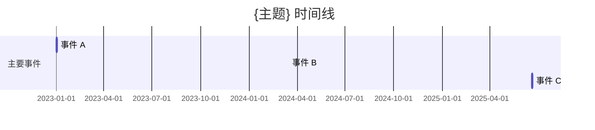

# Digest 模板

## 模板 A：深度报告格式（默认）

```markdown
# {主题} 深度报告

> 综合自 {N} 篇素材 | 生成日期：{日期}

## 背景概述
（简要说明这个主题的背景和重要性）

## 核心观点
（按重要性排列，每个观点标注来源）
- 观点一（来源：[[素材A]]、[[素材B]]）
- 观点二（来源：[[素材C]]）

## 不同视角对比
（如有多个素材观点不同，在此对比）
| 维度 | 来源A的观点 | 来源B的观点 |
|------|------------|------------|

## 知识脉络
（按时间或逻辑顺序梳理该主题的发展）

## 尚待解决的问题
（现有素材中尚未回答的问题，可作为下次搜集素材的方向）

## 相关页面
（列出所有综合来源的链接）
```

## 模板 B：对比表格式（触发词：对比 / 比较）

```markdown
# {对比主题} 对比分析

> 对比 {N} 个对象 | 生成日期：{日期}

## 对比对象
- [[对象 A]]
- [[对象 B]]
- [[对象 C]]（如有）

## 对比表

| 维度       | [[对象 A]] | [[对象 B]] | [[对象 C]] |
|-----------|-----------|-----------|-----------|
| 核心观点   | ...       | ...       | ...       |
| 适用场景   | ...       | ...       | ...       |
| 优点       | ...       | ...       | ...       |
| 缺点 / 限制 | ...       | ...       | ...       |
| 来源素材   | [[素材1]] | [[素材2]] | [[素材3]] |

## 关键差异
（用 1-2 句话说清最重要的差异点）

## 相关页面
```

## 模板 C：时间线格式（触发词：时间线 / 按时间）

```markdown
# {主题} 时间线

> 时间跨度：{起始年} ~ {结束年} | 生成日期：{日期}



## 事件说明
- **2023-01-01 — 事件 A**：简要说明（来源：[[素材A]]）
- **2024-03-15 — 事件 B**：简要说明（来源：[[素材B]]）
- **2025-06-20 — 事件 C**：简要说明（来源：[[素材C]]）

## 相关页面
```

## 时间线格式注意事项

- `gantt` 要求 `YYYY-MM-DD` 精度
- 如果素材只有年份（如 "2023 年"），把日期补为该年第一天（`2023-01-01`）
- 如果连年份都不确定，改用**纯文字时间线**（无序列表按时间排序），不用 Mermaid gantt
- 如果事件超过 15 个，建议按 section 分组，避免图太长