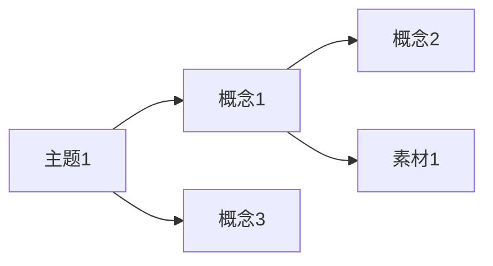

# Graph 工作流详情

## 触发关键词
"画个知识图谱"、"看看关联图"、"graph"、"知识库地图"、"展示知识关联"

## 步骤

### 1. 扫描双向链接
- 遍历 `wiki/` 下所有 `.md` 文件
- 提取每个文件中的 `[[链接]]` 语法，建立关系列表：`页面A → 页面B`

### 2. 生成 Mermaid 图表文件 `wiki/knowledge-graph.md`

```markdown
# 知识图谱

> 自动生成 | {日期} | 共 {N} 个节点，{M} 条关联



查看方式：用 Typora、VS Code（Markdown Preview Enhanced）、或直接在 GitHub 上查看。
```

**生成规则**：
- 节点名用中括号 `[名称]`，名称太长则截断到 10 字
- 只展示有双向链接关系的节点（孤立节点不纳入图谱）
- 如果关系超过 50 条，只保留被引用次数最多的 30 个节点，避免图谱过于密集
- **默认全部使用 `A --> B` 无标注箭头**，不自动判断关系类型

### 2b. 生成交互式图谱数据

```bash
bash scripts/build-graph-data.sh "$WIKI_ROOT"
```

依赖 `jq` + `node`（如缺失可运行 `brew install jq node`）。

### 2c. 生成交互式图谱 HTML

```bash
bash scripts/build-graph-html.sh "$WIKI_ROOT"
```

生成 `wiki/knowledge-graph.html`，离线双击即可打开。

### 3. 读取 insights 并向用户展示结果

```bash
jq '.insights' "$WIKI_ROOT/wiki/graph-data.json"
```

**输出格式**：
```
知识图谱已生成！

共 {N} 个节点，{M} 条关联

图谱洞察：
- 惊人连接：{from} ↔ {to}（跨社区，权重 {weight}）{如有}
- 桥节点：{node}（连接 {count} 个社区）{如有}
- 知识缺口：{node}（度数 {degree}，建议补充素材）{如有}
- 稀疏社区：{community}（密度 {density}）{如有}

查看方式：
- 交互式（推荐）：双击 wiki/knowledge-graph.html
- Mermaid 静态图：wiki/knowledge-graph.md

孤立页面（未纳入图谱）：
- [[某页面]]（建议添加到相关实体页或主题页）
```