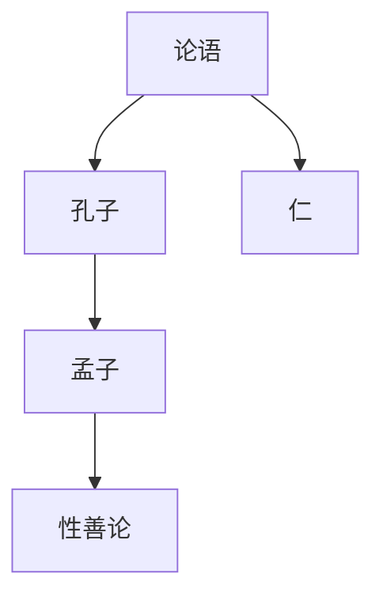
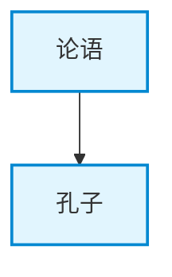
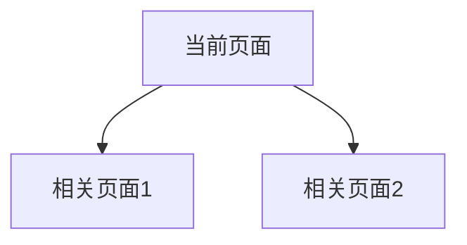

# 知识图谱可视化详解

> 版本: v3.0.0
> 更新: 2026-05-30

## 概述

知识图谱可视化工具将 wiki 中的实体和概念关系转换为图形化表示，帮助用户直观理解知识结构。

## 可视化格式

### 1. Mermaid 图

**特点：**
- 纯文本格式，易于编辑和版本控制
- 可在 Obsidian 中直接渲染
- 支持转换为 PNG、SVG 等图片格式
- 适合嵌入文档和报告

**使用场景：**
- 在 Obsidian 中查看知识网络
- 嵌入到 wiki 页面中
- 生成静态图片用于分享

**示例：**


### 2. 交互式 HTML

**特点：**
- 支持缩放、拖拽、点击交互
- 支持搜索和过滤
- 支持节点详情查看
- 适合浏览器中探索

**使用场景：**
- 在浏览器中探索知识网络
- 演示和展示知识结构
- 深入分析特定节点

**功能：**
- **缩放**: 放大/缩小查看细节
- **拖拽**: 移动节点布局
- **点击**: 查看节点详情和链接数
- **搜索**: 快速定位特定节点

## 使用方法

### 生成 Mermaid 图

```bash
# 生成 Mermaid 图
bash build-graph.sh mermaid

# 输出示例：
# === 生成 Mermaid 图 ===
# Mermaid 图已生成: /root/wiki-ai/_meta/knowledge-graph.mmd
# 
# 使用方法：
# 1. 在 Obsidian 中直接渲染（安装 Mermaid 插件）
# 2. 在线渲染: https://mermaid.live/
# 3. 转换为图片: mmdc -i /root/wiki-ai/_meta/knowledge-graph.mmd -o graph.png
```

### 生成交互式 HTML

```bash
# 生成交互式 HTML
bash build-graph.sh html

# 输出示例：
# === 生成交互式 HTML ===
# 交互式 HTML 已生成: /root/wiki-ai/_meta/knowledge-graph.html
# 
# 使用方法：
# 1. 在浏览器中打开: file:///root/wiki-ai/_meta/knowledge-graph.html
# 2. 部署到 Web 服务器供团队访问
```

### 显示图谱统计

```bash
# 显示图谱统计
bash build-graph.sh stats

# 输出示例：
# === 知识图谱统计 ===
# 
# 节点数: 235
#   实体: 223
#   概念: 12
# 
# 边数（wikilinks）: 450
# 平均链接数: 1
# 
# 分类分布:
#   rujia: 35
#   dao: 35
#   fajia: 7
#   baojia: 20
#   bingjia: 13
#   invest: 71
#   malie: 14
```

## 输出文件

### Mermaid 文件

**位置：** `$WIKI_PATH/_meta/knowledge-graph.mmd`

**格式：**


**使用方法：**
1. **Obsidian 渲染**: 安装 Mermaid 插件，直接在代码块中渲染
2. **在线渲染**: 访问 https://mermaid.live/，粘贴内容
3. **命令行转换**: 使用 mmdc 工具
   ```bash
   # 安装 mermaid-cli
   npm install -g @mermaid-js/mermaid-cli
   
   # 转换为 PNG
   mmdc -i knowledge-graph.mmd -o graph.png
   
   # 转换为 SVG
   mmdc -i knowledge-graph.mmd -o graph.svg
   ```

### HTML 文件

**位置：** `$WIKI_PATH/_meta/knowledge-graph.html`

**功能：**
- **节点样式**: 不同分类使用不同颜色
- **交互功能**: 缩放、拖拽、点击、搜索
- **图例**: 显示各分类的颜色对应
- **控制按钮**: 适应窗口、放大、缩小

**使用方法：**
1. **本地打开**: 双击文件或在浏览器中打开
2. **Web 部署**: 上传到 Web 服务器供团队访问
3. **嵌入**: 使用 iframe 嵌入到其他页面

## 节点样式

### 颜色分类

| 分类 | 颜色 | 说明 |
|------|------|------|
| rujia | 蓝色 (#e1f5fe) | 儒家典籍 |
| dao | 紫色 (#f3e5f5) | 道家典籍 |
| fajia | 橙色 (#fff3e0) | 法家典籍 |
| baojia | 绿色 (#e8f5e9) | 诸子百家 |
| bingjia | 红色 (#fce4ec) | 兵家典籍 |
| invest | 浅绿 (#f1f8e9) | 投资书籍 |
| malie | 深紫 (#ede7f6) | 马列著作 |
| concept | 黄色 (#fff9c4) | 概念页面 |

### 节点大小

- **实体节点**: 10px（默认大小）
- **概念节点**: 10px（默认大小）
- **高链接节点**: 可手动调整大小

## 最佳实践

### 1. 定期更新图谱

```bash
# 每月更新一次图谱
bash build-graph.sh mermaid
bash build-graph.sh html

# 检查新增节点和链接
bash build-graph.sh stats
```

### 2. 使用 Mermaid 嵌入页面

```markdown
# 在 wiki 页面中嵌入图谱


```

### 3. 分析知识结构

```bash
# 查看统计信息
bash build-graph.sh stats

# 识别孤立节点
bash delete-helper.sh orphan

# 识别高链接节点（核心概念）
# 通过交互式 HTML 查看
```

### 4. 优化布局

**Mermaid 布局选项：**
- `graph TD`: 从上到下
- `graph LR`: 从左到右
- `graph TB`: 从上到下（同 TD）
- `graph RL`: 从右到左

**HTML 布局选项：**
- 使用 vis.js 的物理引擎自动布局
- 可调整 `gravitationalConstant` 和 `springLength` 参数
- 支持手动拖拽调整

## 常见问题

### Q: 如何处理大量节点？

A: 对于大型 wiki（100+ 节点）：
1. **分层显示**: 只显示核心节点，隐藏次要节点
2. **过滤功能**: 使用搜索功能定位特定节点
3. **分组显示**: 按分类分组显示
4. **性能优化**: 减少边的数量，简化图谱

### Q: 如何自定义节点样式？

A: 编辑 `scripts/build-graph.sh` 中的样式定义：
```bash
# 修改颜色
classDef rujia fill:#e1f5fe,stroke:#0288d1,stroke-width:2px

# 修改大小
nodes: {
  shape: 'dot',
  size: 10,  # 修改这个值
  font: { size: 12 }
}
```

### Q: 如何添加新的分类？

A: 在 `scripts/build-graph.sh` 中添加新的样式：
```bash
# 添加新分类样式
classDef newCategory fill:#color,stroke:#color,stroke-width:2px

# 在节点分类逻辑中添加
if find "$WIKI_ROOT/entities/newCategory" -name "${source}.md" ...; then
  source_class="newCategory"
fi
```

### Q: 如何导出为其他格式？

A: 使用工具转换：
```bash
# 转换为 PNG
mmdc -i knowledge-graph.mmd -o graph.png

# 转换为 SVG
mmdc -i knowledge-graph.mmd -o graph.svg

# 转换为 PDF
mmdc -i knowledge-graph.mmd -o graph.pdf
```

## 高级功能

### 1. 子图谱生成

```bash
# 生成特定分类的子图谱
grep "rujia" knowledge-graph.mmd > rujia-graph.mmd
```

### 2. 图谱对比

```bash
# 对比不同时间点的图谱
diff knowledge-graph-v1.mmd knowledge-graph-v2.mmd
```

### 3. 图谱分析

```bash
# 分析节点中心性
# 使用 NetworkX 或其他图分析工具
python3 -c "
import networkx as nx
G = nx.read_edgelist('edges.txt')
centrality = nx.betweenness_centrality(G)
print(sorted(centrality.items(), key=lambda x: -x[1])[:10])
"
```

### 4. 图谱导出

```bash
# 导出为 JSON 格式
# 用于其他可视化工具
cat knowledge-graph.html | grep -o '{ nodes: \[.*\], edges: \[.*\] }' > graph.json
```
